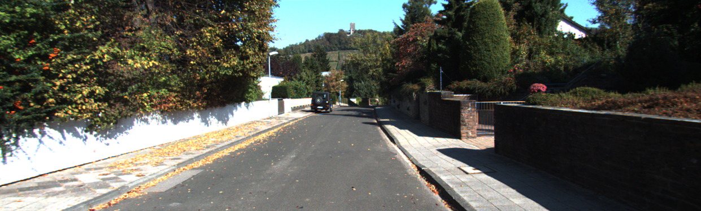

# Road-Segmentation
Code for SMAI Project on Road Segmentation with different Classifiers.

Uploading still in progress


## Dependencies :

* Python2
* Sklearn
* Skimage
* Numpy 
* Glob


## Directory Structure for the code 
```
Road-Segmentation/
|
|--- datasets/
|    |
|    |--- data_road
|    |--- vgg
|
|--- NN_VGG/
|    |
|    |--- Output/
|    |--- nn_vgg.py
|    
|--- SUPERPIX/
|    |
|    |--- main.py
|    |--- test_data.pkl
|    |--- train_data.pkl
|    |--- test_label.pkl
|    |--- train_label.pkl
|    |--- nb_model.pkl
|    
|--- PIX/
|    |
|    |--- main.py
|    |--- test_data.pkl
|    |--- train_data.pkl
|    |--- test_label.pkl
|    |--- train_label.pkl
|    |--- nb_model.pkl
|    
|--- README.md

```

In the datasets, there are two data files present

* data_road : containing the kitti dataset.
* vgg16 : vgg pretrained model

## Setup

1. Clone this repository: `git clone https://github.com/pulkitver1991/Road-Segmentation.git`
2. [Optional] Download Kitti Road Data:
    1. Retrieve kitti data url here: [http://www.cvlibs.net/download.php?file=data_road.zip](http://www.cvlibs.net/download.php?file=data_road.zip)
    2. Download VGG16 Model

## Running the SUPERPIX Code

* The Code use SuperPixel method of segmentation
* The training and testing vector is already created, and is provided in the directory
* If you want to create vector again, set the variable *create_vectors_again* high
* Naive bayes model is already learnt is already provided and be used directly
* To fit a model again, set the variable *start_training_model* high
* Select the Classifier using *select_classifier*
* The available classifiers are : 

	```
	--- Naive Bayes (nb)
	--- SVM (svm)
	--- Random Forest (rf)
	--- KNN (knn)
	```
* Call `python main.py` to run the code	
* The result of the segmented images is saved in *SegmentedImages* Folder

* Some Segmented Results:

  

  


## Running the PIX Code

* The Code use Pixelwise Implementation of segmentation
* The Code displays some intermediate work and may have some bugs
* The training and testing vector is already created, and is provided in the directory
* If you want to create vector again, set the variable *create_vectors_again* high
* Naive bayes model is already learnt is already provided and be used directly
* To fit a model again, change the name of the classifier in `classifier` function and run the code again
* Select the Classifier in the classifier function
* The available classifiers can be : 

	```
	--- Naive Bayes (nb)
	--- SVM (svm)
	--- Random Forest (rf)
	--- KNN (knn)
	```

* Some Segmented Results:

  

  


## Running the NN_VGG Code